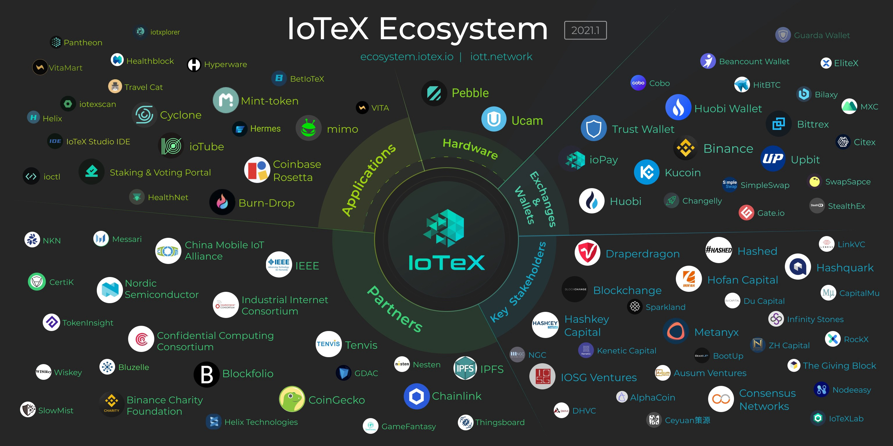

# 项目介绍

IoTeX作为硅谷开源项目成立于2017年，以链接现实世界和数字世界为愿景，是新一代与以太坊全兼容的高性能公有区块链。IoTeX致力于将区块链、可信硬件与物理世界数据预言机结合起来，为分布式应用和数字资产提供开放、可信、高效、自治的基础设施，创造全新的机器金融和数据信息市场。

## 🏢 团队介绍

IoTeX 作为硅谷开源项目成立于2017年，团队由30多位密码学、分布式系统和机器学习等领域的博士、资深工程师和经验丰富的生态系统开发者组成。多位团队成员来自Google, Facebook, Uber, Bosch等跨国公司。

创始人介绍 

Raullen Chai：IoTeX联合创始人，曾作为加密研究与开发部门负责人就职于Uber，毕业于滑铁卢大学并获得电子计算机专业博士学位与研究科学家。

Qevan Guo：IoTeX联合创始人，Facebook早期工程经理和研究科学家，增长黑客，新加坡国立大学机器学习和机器视觉博士。

Xinxin Fan：Bosch资深研究科学家，毕业于滑铁卢大学并获得加密学博士学位

Jing Sun：IoTeX联合创始人，Sparkland 基金合伙管理人，此基金是硅谷最活跃的前沿科技基金之一。

IoTeX基金会由Robert Parker、Jack Li和Michael Cho等知名顾问组成，并获得DraperDragon、HASHED、HashKey、Blockchange 和 IOSG 等 30 多家机构投资者的支持。


更多[IoTeX团队](https://iotex.io/team/)和[投资人团队](https://preview.redd.it/lee7cdl74c111.png?width=1031&format=png&auto=webp&s=2330810490709a1a7a5adfdf5011ca461e28cbd4)详情


## 🌎 **IoTeX**生态系统

IoTeX是一个由用户、开发人员和企业组成的去中心化网络，所有参与者共同管理和使用IoTeX平台。作为兼容EVM的“L1”区块链网络，IoTeX为由智能设备、DApp和数字资产组成的生态系统源源不断提供动力。在IoTeX网络中，交易和智能合约由IOTX通证实现，所有持有IOTX的人都可以成为IoTeX的股东。自2019年4月IoTeX主网成功上线以来，一直运行平稳，从未出现过宕机。目前，IoTeX网络由来自全球的60多名节点\(包括Blockfolio、CoinGecko和DraperDragon\)以去中心化的方式维护网络安全。欢迎所有志同道合的小伙伴们加入IoTeX遍及100多个国家，超过10万人的社区，让我们共同为可信物联网的愿景而努力！


更多IoTeX的生态项目详情


