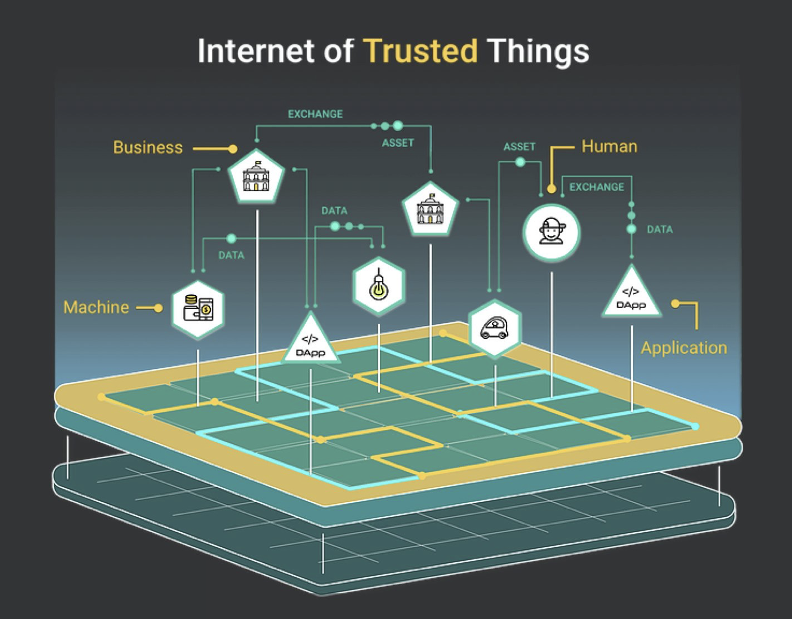

# Introduction

IoTeX was founded as an open-source platform in 2017 with a vision for the **Internet of Trusted Things,** a decentralized ecosystem where humans and machines can interact with guaranteed security and trust. We are on a mission to ensure everyday people and businesses can own and control their devices, as well as the data/value they generate. By connecting the physical and digital worlds, IoTeX will democratize access to machine-backed DApps, assets, and services to deliver value to users and fuel the new machine economy.

## :office: IoTeX Team

IoTeX is headquartered in Silicon Valley and is backed by a global team of 30+ top tier engineers, research scientists, and operators from Google, Facebook, Uber, Bosch, and more. The founding team includes:

* ****[**Raullen Chai**](https://www.linkedin.com/in/raullenchai/): Head of Cryptography at Uber, PhD in Computer Science from University of Waterloo
* ****[**Qevan Guo**](https://www.linkedin.com/in/donguo): Product Lead at Facebook, PhD in Machine Learning from University of Singapore
* ****[**Xinxin Fan**](https://www.linkedin.com/in/xinxin-fan-crypto/): Sr. Research Scientist at Bosch, PhD in Cryptography from University of Waterloo
* ****[**Jing Sun**](https://www.linkedin.com/in/cbetasun/):** **Managing Partner at Sparkland Capital, a Silicon Valley-based Venture Capital firm

IoTeX is supported by renowned Advisors, including [Robert Parker](https://www.linkedin.com/in/robert-parker-44b5024/), [Jack Li](https://cn.linkedin.com/in/jack-lee-89059a29), and [Michael Cho](https://www.linkedin.com/in/minshik-michael-cho-7a8a70148/), as well as 30+ institutional investors, including DraperDragon, HASHED, HashKey, Blockchange and IOSG.


Meet the [full team](https://iotex.io/team/) and our [investors](https://preview.redd.it/lee7cdl74c111.png?width=1031\&format=png\&auto=webp\&s=2330810490709a1a7a5adfdf5011ca461e28cbd4).


## :earth\_americas: **IoTeX Ecosystem**

IoTeX is a decentralized network of users, developers, and enterprises that collectively govern and utilize the IoTeX platform. As an EVM-compatible "Layer 1" blockchain, IoTeX now powers an ever-growing [ecosystem](https://ecosystem.iotex.io) of smart devices, DApps, and digital assets. Network transactions and smart contracts are fueled by the IOTX token, which also enables anyone to be a shareholder in the IoTeX Network. The IoTeX Mainnet has been running error-free since April 2019 and is maintained in a decentralized fashion by [>60 Delegates](https://member.iotex.io), including Blockfolio, CoinGecko, and DraperDragon. Join our community of 100,000+ people across 100+ countries that are connected by a shared vision for the Internet of Trusted Things.


Explore our [ecosystem](https://ecosystem.iotex.io) of projects, partners, and exchanges.

