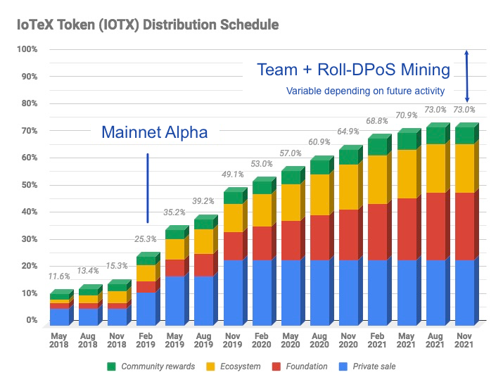

# IOTX Token Metrics

* **Maximum Supply:** 10 Billion IOTX
* **Total Supply:** 8.8 Billion IOTX _\(after Burn-Drop\)_
  * 900 Million IOTX \(9% of max supply\) will be gradually burned as we onboard 1 Million devices on IoTeX \(see [Burn-Drop](https://burndrop.iotex.io)\)
  * 265 Million IOTX \(2.65% of max supply\) was burned in June 2020 as part of [Mainnet GA activation](https://community.iotex.io/t/burning-2-65-of-total-iotx-supply-from-iotex-foundation-funds/1261)
* **Circulating Supply:** see graph below for current supply of IOTX

最大供应量：100亿IOTX

总供应量：88亿IOTX（烧投计划后）

• 随着在IoTeX网络上链互联100万台智能设备，将会有9亿个IOTX（约为最大供应量的9%）被烧毁（详情请见烧投计划官网”）

• 2020年6月，为了成功上线主网GA，IoTeX烧毁了2.65亿个IOTX（约为最大供应量的2.65%）

流通供应量：当前IOTX流通数量如下

#### **1. Private Sale: 24% of total supply** 

IoTeX held a private sale to 30+ non-USA, accredited investors in Jan 2018. A total of 25,000 ETH \(~$25M\) was raised @ 1 IOTX = 0.0000125 ETH. IoTeX did not have a public ICO due to regulatory reasons. Private sale tokens have been fully distributed in 2018-2020.

 1. 私募份额：占总供应量的24%

2018年1月，IoTeX向30多个非美国的合格投资者进行了私人销售，以1 IOTX = 0.0000125 ETH的价格共计筹得25000 ETH，约为 2500万美元。由于监管原因，IoTeX当时并没有公开进行ICO，私募份额已经于2018-2020年分发完毕。

#### **2. Ecosystem: 18% of total supply** 

The Ecosystem fund is for bootstrapping the IoTeX ecosystem, including strategic partners, developers, and marketing efforts. Specifically, the Ecosystem fund has been allocated to [Burn-Drop](https://burndrop.iotex.io) \(10% of total supply\) and the [Halo Grants Program](https://iotex.io/halo) \(8% of total supply\). Ecosystem tokens are unlocked gradually over the course of 3 years after token issuance date.

 2. 生态系统：占总供应量的18% 生态系统基金用于IoTeX生态系统的搭建，包括战略合作伙伴、开发人员和市场推广。具体来说，基金主要将资金分配给了烧投计划（总供应量的10%）和Halo开发社区激励计划（总供应量的8%）。生态系统通证将在发行后的3年内逐渐解锁。

#### **3. Foundation: 25% of total supply** 

The Foundation fund is reserved to build and evolve the IoTeX platform + protocol, as well as to sustain the long-term growth of IoTeX. It is also used to fund cryptography, blockchain, and IoT research and onboard future development teams and contributors. Foundation tokens are unlocked gradually over the course of 3 years after token issuance date:

 3.基金会：占总供应量的25%

基金会资金主要用于IoTeX平台+协议的构建，以及生态网络的长期发展。此外，还用于加密货币、区块链和物联网方面的研究，以及对开发团队和特殊贡献者的奖励。基金会持有的通证将在发行后的3年内逐步解锁。

#### **4. Team - 15% of total supply** 

The core team will receive an allocation of tokens, with each individual following an unlock schedule based on their start date. Team tokens have a vesting period of 4 years after start date with a 6-month cliff. Team tokens are meant to last for 10+ years to bring on future core team members. The first distribution of team tokens occurred in February 2019.

 4. 团队份额：占总供应量的15% 核心团队会获得相应的通证份额，每个人根据收到份额的时间会有不同的解锁日期。在经过6个月的cliff后正式进入4年的授予期vesting period。为了培养团队的核心成员，激励机制将持续10年以上。我们在2019年2月首次进行了通证份额的分配。

**5. Roll-DPoS Mining Rewards: 12% of total supply**

To fuel mining / block production by IoTeX Delegates, 12% of the total supply has been reserved for Roll-DPoS mining rewards, which commenced in April 2019 as part of Mainnet Alpha. These rewards are delivered by the IoTeX protocol to Delegates, who often share rewards with their voters.



5. Roll-DPoS挖矿奖励：占总供应量的12%

为了激励IoTeX节点参与共识，我们预留了12%的总供应量作为Roll-DPoS的挖矿奖励，并作为主网Alpha的一部分于2019年4月开始实施。这些奖励将通过IoTeX协议发放给节点，而节点也用来回馈他的支持者们。

#### **6. Community Reward Programs: 6% of total supply** 

The community rewards fund is meant to incentivize community engagement and participation in IoTeX initiatives. Unlocked gradually over the course of 3 years after token issuance date.

6. 社区奖励计划：占总供应量的6% 

社区奖励基金旨在激励社区用户积极参与IoTeX的项目和活动，这些通证将在发行后的3年内逐步解锁。

